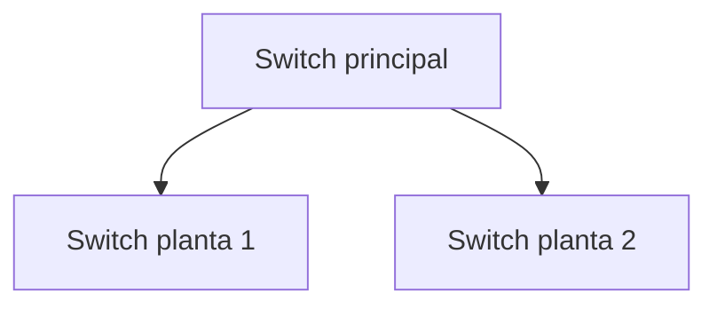

# Cuaderno de actividades FFEOE

Cuadernillo de prácticas para fase de formación en empresas u organismos equiparados, para el IES Almunia de Jerez de la Frontera (Cádiz) y el curso 2025/2026. Ciclo Formativo de Sistemas Microinformáticos y Redes.

En la subcarpeta `/actividades` puedes construir en orden las actividades en formato markdown. **El sistema las tomará por orden alfabético**.

### Generar el documento

| Comando | Acción |
|---|---|
| `make build` | Imagen Docker ligera (~1GB) |
| `make build-mermaid` | Imagen con soporte Mermaid (~2GB), depende de la anterior |
| `make pdf` | Genera el PDF en local |
| `make pdf-mermaid` | Genera el PDF con soporte de diagramas Mermaid |

En Linux usa `make <comando>`, en Windows `make.bat <comando>`.

El repositorio tiene unas GitHub actions para que cada vez que haya un commit, se genere el PDF de actividades y se publique en las `releases`

### Diagramas con Mermaid

El sistema admite diagramas y esquemas generados con [Mermaid](https://mermaid.js.org/). Para usarlos:

1. Construye la imagen con soporte Mermaid: `make build-mermaid`
2. Genera el PDF con: `make pdf-mermaid`
3. En cualquier `.md` incluye bloques de código con el lenguaje `mermaid`:

````md

````
